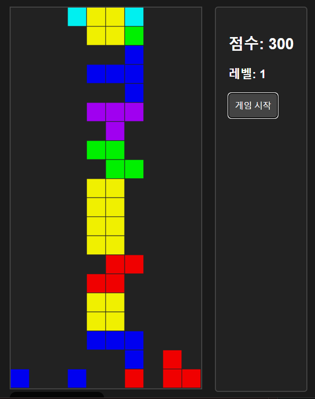

# 테트리스 게임

## 게임 소개

- 테트리스 게임은 블록을 쌓아 올리는 게임입니다.
- 블록은 4x4 크기의 정사각형 블록으로 구성되어 있습니다.
- 블록은 회전하여 놓을 수 있습니다.

## 게임 규칙

- 블록은 회전하여 놓을 수 있습니다.
- 블록은 일정 시간마다 아래로 내려옵니다.
- 블록은 화면 바닥에 닿으면 게임 오버입니다.

## 만드는 방법을 배울 수 있는 곳

- [코딩 애플](https://www.youtube.com/watch?v=Q5-YJLw-_4c)
